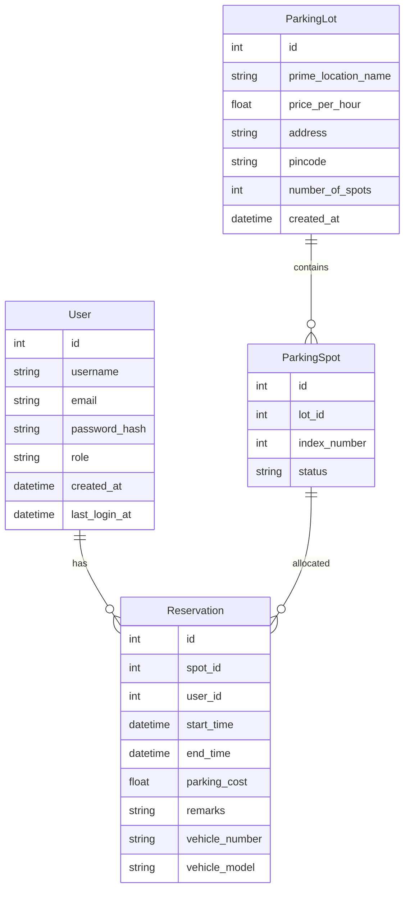

# ER Diagram & Schema Description

Entities:

## User
- id (PK, int)
- username (unique, str)
- email (unique, nullable, str)
- password_hash (str)
- role (enum: admin|user)
- created_at (datetime UTC)
- last_login_at (datetime UTC nullable)
Relationships:
- 1:N with Reservation (User.id -> Reservation.user_id)

## ParkingLot
- id (PK, int)
- prime_location_name (str)
- price_per_hour (float)
- address (str nullable)
- pincode (str nullable)
- number_of_spots (int)
- created_at (datetime UTC)
Relationships:
- 1:N with ParkingSpot (ParkingLot.id -> ParkingSpot.lot_id)

## ParkingSpot
- id (PK, int)
- lot_id (FK -> ParkingLot.id)
- index_number (int, unique per lot via uq_lot_index)
- status (enum: A|O)
Relationships:
- 1:N with Reservation (ParkingSpot.id -> Reservation.spot_id)
- N:1 to ParkingLot

## Reservation
- id (PK, int)
- spot_id (FK -> ParkingSpot.id)
- user_id (FK -> User.id)
- start_time (datetime UTC)
- end_time (datetime UTC nullable)
- parking_cost (float nullable)
- remarks (str nullable)
- vehicle_number (str nullable)
- vehicle_model (str nullable)
Relationships:
- N:1 to User
- N:1 to ParkingSpot

## Role / SpotStatus (Enums)
Represented as string fields on User.role and ParkingSpot.status.

---
## Mermaid Source

---
## Indexes & Constraints
- users.username UNIQUE
- users.email UNIQUE (nullable)
- parking_spots (lot_id, index_number) UNIQUE (uq_lot_index)
- Foreign keys with CASCADE delete on parking_spots (lot -> spots) and orphan removal of spots and reservations.

---
## Design Notes
- Reservation end_time null indicates active reservation.
- parking_cost populated only on release.
- number_of_spots change triggers creation/removal of ParkingSpot rows with safety (only AVAILABLE spots can be removed).

---
## Potential Extensions
- Add Payment, Invoice tables if monetization needed.
- Add AuditLog for security events.
- Add RefreshToken store (if implementing long-lived sessions).
